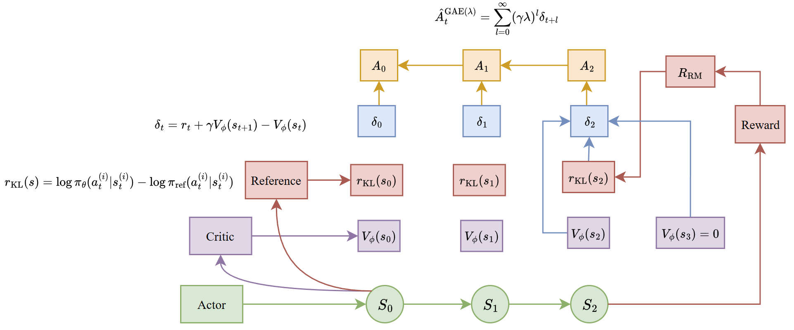

# RL工程实践
RL的数学理论并不能之间转化为工程实践，需要用一系列策略去逼近数学理论的真实值。

# RL + LLM, 以 PPO为核心例子

我绘制了这个图很好解释：


| **t** | **状态 st​** | **动作 at​** | **KL 惩罚** | **RM 奖励** | **总奖励 rt​** | **Critic Vϕ​(st​)** | **TD 误差 δt​** | **优势 At​ (GAE)** | **累计回报 Gt​** |
| ----- | ---------- | ---------- | --------- | --------- | ----------- | ------------------- | ------------- | ---------------- | ------------ |
| **0** | `"天空"`     | `"很"`      | -0.05     | —         | **-0.05**   | 2.0                 | **-0.70**     | **0.9148**       | **2.9148**   |
| **1** | `"天空很"`    | `"蓝"`      | -0.03     | —         | **-0.03**   | 1.5                 | **-0.63**     | **2.2428**       | **3.7428**   |


1. Actor生成完整轨迹：输入prompt  $`s_0`$ ，Actor  $`\pi_\theta`$ 自回归生成完整token序列，得到轨迹：

```math
\tau = [s_0, a_0, a_1, ..., a_{T-1}]
```

其中：
-  $`s_t`$ ：第  $`t`$  步的状态，即  $`[s_0, a_0, ..., a_{t-1}]`$ （上文序列）
-  $`a_t`$ ：第  $`t`$  步生成的token（动作）
- 同时记录每个token的对数概率  $`\log \pi_\theta(a_t|s_t)`$ ，用于后续计算重要性权重

2. 计算逐token KL散度惩罚：
对每个生成的token，计算Actor与Ref模型的KL散度，作为逐token惩罚项：

```math
\text{KL}_t = \text{KL}\left( \pi_\theta(\cdot|s_t) \parallel \pi_{ref}(\cdot|s_t) \right) = \sum_{v \in \text{Vocab}} \pi_\theta(v|s_t) \log \frac{\pi_\theta(v|s_t)}{\pi_{ref}(v|s_t)}
```

逐token的即时奖励为：

```math
r_t = -\beta \cdot \text{KL}_t
```

其中  $`\beta`$  为KL惩罚系数，控制对齐与能力保留的平衡。


3. RM给出全局奖励，补全最终步奖励
将完整的(prompt, response)对输入RM，得到全局奖励分  $`r_{RM}`$ ，加到轨迹最后一步的即时奖励中：

```math
r_{T-1} = r_{T-1} + r_{RM}
```

此时轨迹的总奖励为：

```math
R_{total} = r_{RM} - \beta \cdot \sum_{t=0}^{T-1} \text{KL}_t
```


4. Critic估计状态价值，计算GAE优势
-  Critic对每个状态 $`s_t`$ 输出价值估计 $`V_\phi(s_t)`$ 
- 计算每个时间步的TD误差 $`\delta_t = r_t + \gamma V_\phi(s_{t+1}) - V_\phi(s_t)`$ （终止状态 $`s_T`$ 的 $`V_\phi(s_T)=0`$ ）
- 从后往前计算每个token的GAE优势

```math
A_t = \delta_t + \gamma \cdot \lambda \cdot A_{t+1}
```

- 以及折扣累计回报（用于Critic更新）

```math
A_t = G_t - V_\phi(s_t) \implies G_t = A_t + V_\phi(s_t)
```


# 各种方法的对比

## 1. PPO vs. DPO

- **PPO (Proximal Policy Optimization)**:
 **本质**：在线（Online）策略梯度算法。通过维持一个 Actor-Critic 架构，利用 Reward Model 产生的信号来更新策略。
 **数学**：核心是 **Clipped Surrogate Objective**：
        
```math
\mathcal{L}^{CLIP} = \hat{\mathbb{E}}_t [\min(r_t(\theta)\hat{A}_t, \text{clip}(r_t(\theta), 1-\epsilon, 1+\epsilon)\hat{A}_t)]
```

 **改进**：引入 Trust Region 思想防止步子迈得太大（训练崩掉）。
        
- **DPO (Direct Preference Optimization)**:
**本质**：离线（Offline）直接对齐。它证明了奖励函数可以用最优策略的 Log 比值表达，从而跳过了显式奖励模型。
**数学**：通过极大似然估计直接在偏好数据上闭式求解：
        
```math
\mathcal{L}_{DPO}(\pi_\theta; \pi_{ref}) = -\mathbb{E}_{(x, w, l) \sim \mathcal{D}} \left[ \log \sigma \left( \beta \log \frac{\pi_\theta(w|x)}{\pi_{ref}(w|x)} - \beta \log \frac{\pi_\theta(l|x)}{\pi_{ref}(l|x)} \right) \right]
```
        
- **对比**：PPO 上限高（动态探索）、工程重（4 个模型）；DPO 简单稳定、但受限于数据分布。
    

## 2. 前沿算法：GRPO & DAPO

- **GRPO (Group Relative Policy Optimization)**:
 **创新**：DeepSeek 提出。**去掉 Critic 网络**，通过对同一 Prompt 生成一组输出并计算相对得分（组内归一化）作为优势函数。
 **场景**：大规模强化学习，显著降低显存开销。
        
- **DAPO (Direct Alignment from Preference Optimization)**:
 **改进**：旨在解决 DPO 在某些分布下权重偏移过大的问题，通常在计算 KL 散度约束时做了更细致的平滑。
        

## 3. KL 散度与优势函数

在传统的 SFT（监督微调） 中，真实分布  $`P`$  是 One-hot 编码（Label），其熵  $`H(P)`$  是常数 0。因此，优化交叉熵等价于优化 KL 散度。
但在 RLHF/DPO 中，基座模型（Reference Model）的输出是一个概率分布，其熵不为 0，此时必须显式考虑 KL 散度。

## 4. 与交叉熵（Cross-Entropy）的关系

这是面试的高频考点。我们可以通过对对数项进行展开来观察：

```math
D_{KL}(P \| Q) = \sum P(x) \log P(x) - \sum P(x) \log Q(x)
```

将这两项分别定义：

1.  $`- \sum P(x) \log P(x) = H(P)`$ ：这是分布  $`P`$  的**信息熵**。
    
2.  $`- \sum P(x) \log Q(x) = H(P, Q)`$ ：这是  $`P`$  与  $`Q`$  的**交叉熵**。
    

**由此得出核心等式：**

```math
H(P, Q) = H(P) + D_{KL}(P \| Q)
```


## 5.  **KL 散度**：

- **数学**： $`D_{KL}(P\|Q) = \sum P(x) \log \frac{P(x)}{Q(x)}`$ 。
        
- **本质**：衡量新旧分布的差异。在 Reward 中加  $`-KL`$  是为了防止模型为了骗分而跑偏（Reward Hacking）；在 Loss 中则是约束项。

```math
R_{total}(x, y) = R_{model}(x, y) - \beta D_{KL}(\pi_{\theta} \| \pi_{ref}) 
```
Soft-Constraint（软约束）

它定义了参数更新的可行域（Trust Region）。在 DPO 中，KL 惩罚被巧妙地包裹进了公式推导中。硬约束

        
## 6. **优势函数 (GAE)**：
  
- **本质**：衡量“当前动作比平均预期好多少”。
        
- **GAE (Generalized Advantage Estimation)**：通过  $`\lambda`$  参数在偏差（Bias）和方差（Variance）之间平衡。

GAE 的公式是将不同步长的 TD 误差进行加权指数平均：

```math
\hat{A}_t^{GAE} = \sum_{l=0}^{\infty} (\gamma \lambda)^l \delta_{t+l}
```

这里的  $`\lambda`$  (取值 0 到 1) 是调优的关键，它在偏差（Bias）和方差（Variance）之间做平衡：情况 A：当  $`\lambda = 0`$ （高偏差，低方差）公式退化为： $`\hat{A}_t = \delta_t = r_t + \gamma V(s_{t+1}) - V(s_t)`$ 。本质：完全依赖 Critic 网络的预测。特点：低方差：只看一步，受随机采样波动影响小。高偏差：如果 Critic 网络（ $`V`$ ）预测得不准，优势函数就会被带偏。情况 B：当  $`\lambda = 1`$ （低偏差，高方差）公式变为 蒙特卡洛（MC） 累计奖励减去基准线： $`\hat{A}_t = \sum \gamma^l r_{t+l} - V(s_t)`$ 。本质：直接看这一条路走到底的真实总分. 特点：低偏差：用的是真实的累计奖励，没有模型预测的偏差。高方差：LLM 生成序列很长，后续路径的随机性极大（每一个 token 的选择都会导致最终分数巨变），导致梯度极其不稳定。

- 当我们希望减少对 Critic 网络准确性的依赖时，调大  $`\lambda`$ （增加经验成分）；
    
- 当我们希望训练更稳、减少采样随机噪声时，调小  $`\lambda`$ （增加模型预测成分）。

- **重要性采样 (Importance Sampling)**：
**本质**：用旧分布采集的数据来更新新分布的参数。
**边界处理**：当比值  $`\frac{\pi_{new}}{\pi_{old}}`$  偏离 1 太远时，权重会失效，因此 PPO 必须使用 Clip。
        

---

## 7.  奖励模型与训练实践
1. 奖励模型 (RM) 的设计

- **为什么用大模型做 RM？**：语义感知能力强。RM 不仅仅是打分，它需要理解回答的**逻辑性、安全性、格式一致性**。
    
- **设计**：通常在 SFT 模型后接一个 Scalar Head。训练目标是使模型对  $`Chosen`$  答案的打分高于  $`Rejected`$ 。
    

 2. 训练瓶颈：Hacking 与坍缩

- **Reward Hacking**：模型发现了 RM 的漏洞（如：只要加一堆感叹号分数就高）。
    
    - **对齐方案**：更强的 KL 约束、多 RM 集成打分。
        
- **奖励坍缩 (Reward Collapse)**：模型为了稳拿高分，只输出几类极端保守的回答。
    
    - **方案**：增加熵正则项，维持生成的多样性。
        

3. RLVR (强化学习验证器)

- **本质**：基于**可验证事实**的奖励（如 Math 结果对不对、代码能不能跑通）。
    
- **是否为 SFT？**：不是。SFT 是模仿范文，RLVR 是在**结果导向**下进行的自我探索。
    
- **缺陷**：过于依赖硬性指标，可能导致过程逻辑混乱但结果正确。
    
- **优化**：结合 **Process-based Reward (PRM)** 对中间步骤打分。
    

 4. 监控指标与异常分析

- **KL 散度**：平稳上升是好，突然暴涨意味着模型崩溃。
    
- **Reward Mean**：整体趋势应上升。
    
- **Response Length**：警惕模型为了骗分越写越长（Verbosity Bias）。
    
- **Policy Loss / Value Loss**：观察是否收敛。
    

- **Loss 突增**：检查数据中是否有脏数据，或减小 Learning Rate。
    
- **Reward 高但效果差**：典型的 Reward Hacking，需要重新评估 RM 或加大 KL 惩罚。
